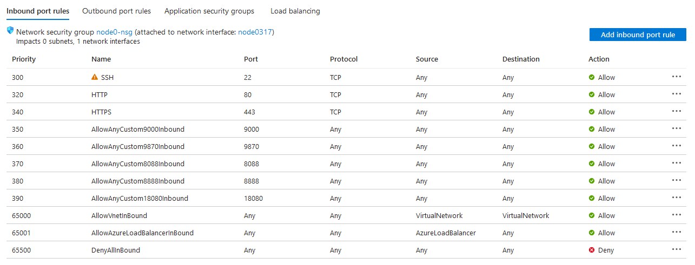
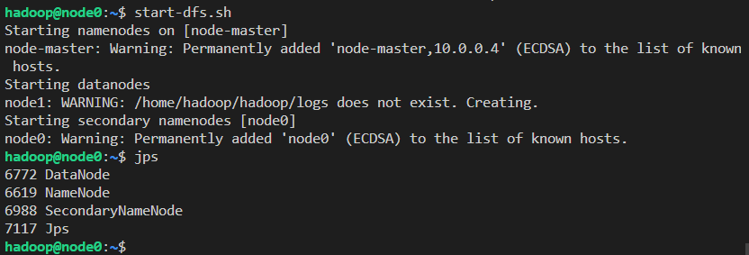
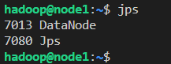
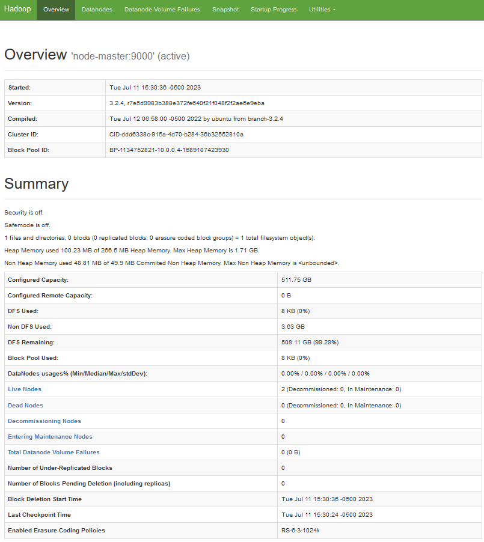
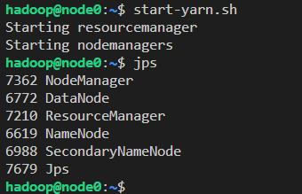
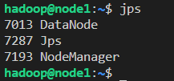
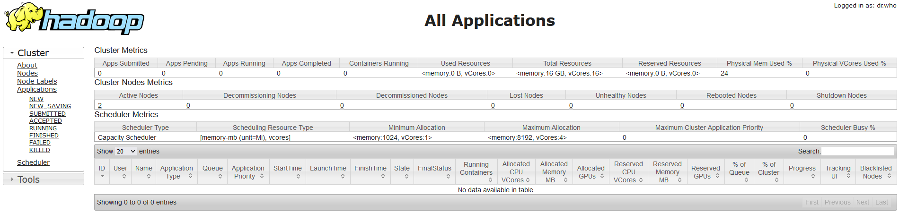
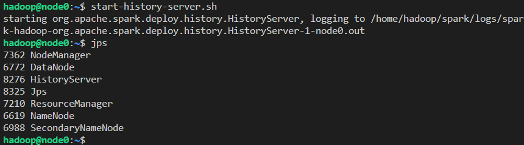
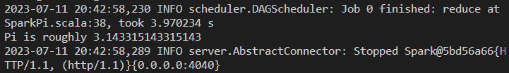
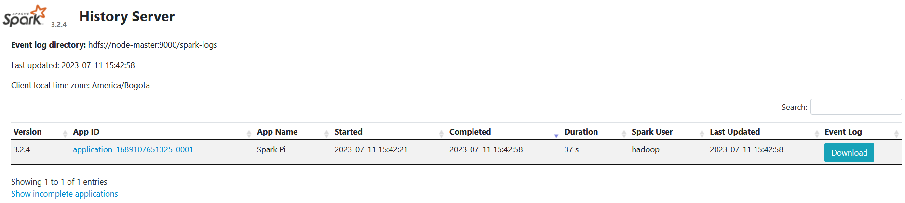

# Big Data - Análisis de sentimiento en tweets sobre el COVID-19

## Integrantes
* Luis Carbajal
* Jorge Castillo

## Pasos para reproducir

### Creación de máquinas virtuales
1. Crear una cuenta en Microsoft Azure, puedes hacerlo desde [este enlace](https://azure.microsoft.com/en-us/free).
2. En el portal de Azure, ir a la sección de máquinas virtuales y hacer click en "Create".

   

4. Modificar la configuración básica de la máquin virtual a crear. Los campos a modificar son el tamaño (Standard_D2s_v3), el tipo de autenticación (password) y el username/password (a preferencia, debe ser el mismo en ambas máquinas virtuales).

   

5. En la sección de "Disks" hacer click en "Create and attach new disk".

   

6. Crear el disco de 256 GB de tamaño. Luego asegurarse que esté en modo Read/write.
   
   
   

7. Crear la máquina virtual. Repetir el mismo proceso desde el paso 2 para la segunda máquina virtual. Al finalizar, la sección de máquinas virtuales debería contener ambas máquinas creadas.

   

9. En la máquina virtual del nodo master, abrir los puertos 9000, 9870, 8088, 18080 y 8888 que van a ser usados para ejecutar servicios en pasos siguientes.

   

### Montar discos agregados

1. Conectarse a una de las máquinas virtuales con ssh usando el usuario y la ip pública de la máquina. Cuando se solicite, ingresar la contraseña.
   ```
   ssh usuario@ip-publica
   ```
2. Encontrar el disco agregado usando el comando y viendo aquel con el tamaño esperado:
   ```
   lsblk -o NAME,HCTL,SIZE,MOUNTPOINT | grep -i "sd"
   ```
   El output obtenido es similar al siguiente, donde sdc es el disco objetivo:

   

3. Particiona el disco con los siguientes comandos adptándolos al nombre de tu disco:
   ```
   sudo parted /dev/sdc --script mklabel gpt mkpart xfspart xfs 0% 100%
   sudo mkfs.xfs /dev/sdc1
   sudo partprobe /dev/sdc1
   ```
4. Monta el disco usando los siguientes comandos:
   ```
   sudo mkdir /datadrive
   sudo mount /dev/sdc1 /datadrive
   ```
   Puedes correr una vez más el comando en el paso 2 para verificar que se haya montado correctamente. El output obtenido debría ser similar al siguiente:

   

5. Actualizar los permisos del directorio sobre el que se montó el disco:
   ```
   sudo chmod -R 777 /datadrive
   ```
   Repetir todo el procedimiento para la otra máquina virtual.
   
### Instalación de Hadoop
Todos los pasos en esta sección deben realizarse sobre la máquina que va a actura como nodo master, a menos que se indique lo contrario.

1. Actualizar el sistema de la máquina virtual e instalar Java con los comandos:
   ```
   sudo apt-get update && sudo apt-get upgrade
   sudo apt-get install openjdk-8-jdk
   ```
   Puedes verificar la instalación con el comando:
   ```
   java -version
   ```
   El output debería ser similar al siguiente:

   

2. Editar el archivo /etc/hosts agregando las ips privadas de ambas máquinas virtuales con sus respectivos roles. El archivo debería verse de la siguiente forma:
   ```
   10.0.0.4 node-master
   10.0.0.5 node1
   ```
   Repetir los pasos 1 y 2 en la otra máquina virtual

3. Generar una llave SSH para la conexión entre nodos con el siguiente comando y dejando todos los campos solicitados en blanco:
   ```
   ssh-keygen -b 4096
   ```
   Se generará una llave pública en el archivo /home/hadoop/.ssh/id_rsa.pub. Copiar el contenido del archivo y colocarlo en ~/.ssh/authorized_keys en ambas máquinas virtuales.

4. Descargar y descomprimir los binarios de Hadoop con los siguientes comandos:
   ```
   cd
   wget https://dlcdn.apache.org/hadoop/common/hadoop-3.2.4/hadoop-3.2.4.tar.gz
   tar -xzf hadoop-3.2.4.tar.gz
   mv hadoop-3.2.4 hadoop
   ```

5. Definir variables de entorno. Agregar en el archivo /home/hadoop/.profile la siguiente línea:
   ```
   PATH=/home/hadoop/hadoop/bin:/home/hadoop/hadoop/sbin:$PATH
   ```
   Agregar en el archivo /home/hadoop/.bashrc las siguientes líneas:
   ```
   export HADOOP_HOME=/home/hadoop/hadoop
   export PATH=${PATH}:${HADOOP_HOME}/bin:${HADOOP_HOME}/sbin
   ```

6. Configurar Hadoop. Agregar en el archivo ~/hadoop/etc/hadoop/hadoop-env.sh la siguiente línea:
   ```
   export JAVA_HOME=/usr/lib/jvm/java-8-openjdk-amd64/jre
   ```
   Actualizar el archivo ~/hadoop/etc/hadoop/core-site.xml a lo siguiente:
   ```
   <?xml version="1.0" encoding="UTF-8"?>
   <?xml-stylesheet type="text/xsl" href="configuration.xsl"?>
     <configuration>
       <property>
         <name>fs.default.name</name>
         <value>hdfs://node-master:9000</value>
       </property>
     </configuration>
   ```
   Actualizar el archivo ~/hadoop/etc/hadoop/hdfs-site.xml a lo siguiente:
   ```
   <configuration>
    <property>
            <name>dfs.namenode.name.dir</name>
            <value>/home/hadoop/data/nameNode</value>
    </property>

    <property>
            <name>dfs.datanode.data.dir</name>
            <value>/datadrive/data/dataNode</value>
    </property>

    <property>
            <name>dfs.replication</name>
            <value>2</value>
    </property>
   </configuration>
   ```
   Actualizar el archivo ~/hadoop/etc/hadoop/mapred-site.xml a lo siguiente:
   ```
   <configuration>
    <property>
            <name>mapreduce.framework.name</name>
            <value>yarn</value>
    </property>
    <property>
            <name>yarn.app.mapreduce.am.env</name>
            <value>HADOOP_MAPRED_HOME=$HADOOP_HOME</value>
    </property>
    <property>
            <name>mapreduce.map.env</name>
            <value>HADOOP_MAPRED_HOME=$HADOOP_HOME</value>
    </property>
    <property>
            <name>mapreduce.reduce.env</name>
            <value>HADOOP_MAPRED_HOME=$HADOOP_HOME</value>
    </property>
   </configuration>
   ```
   Actualizar el archivo ~/hadoop/etc/hadoop/yarn-site.xml a lo siguiente, considerar la ip privada del nodo master en el campo de yarn.resourcemanager.hostname:
   ```
   <configuration>
    <property>
            <name>yarn.acl.enable</name>
            <value>0</value>
    </property>

    <property>
            <name>yarn.resourcemanager.hostname</name>
            <value>ip-privada</value>
    </property>

    <property>
            <name>yarn.nodemanager.aux-services</name>
            <value>mapreduce_shuffle</value>
    </property>
   </configuration>
   ```
   Actualizar el archivo ~/hadoop/etc/hadoop/workers a lo siguiente:
   ```
   node-master
   node1
   ```

7. Copiar los binarios de Hadoop del nodo master al nodo worker con el siguiente comando:
   ```
   scp hadoop-*.tar.gz node1:/home/hadoop
   ```
   Conectarse al nodo worker desde el master usando ssh para extraer los archivos con los siguientes comandos:
   ```
   ssh node1
   tar -xzf hadoop-3.2.4.tar.gz
   mv hadoop-3.2.4 hadoop
   exit
   ```
   Copiar los archivos de configuración al nodo worker con el siguiente comando:
   ```
   scp ~/hadoop/etc/hadoop/* node1:/home/hadoop/hadoop/etc/hadoop/
   ```

8. Formatear el clúster HDFS con el siguiente comando:
   ```
   hdfs namenode -format
   ```
   Iniciar el clúster con el siguiente comando:
   ```
   start-dfs.sh
   ```
   Puedes comprobar que los procesos se están ejecutando correctamente usando el comando `jps` y revisando los outputs en cada nodo. El nodo master debería mostrar el siguiente output:

   

   El nodo worker debería mostrar el siguiente output:

   

   También puedes acceder a la interfaz web para visualizar el estado del clúster en la dirección http://IP:9870, donde IP es la ip pública del nodo master.

   

9. Iniciar YARN con el siguiente comando:
   ```
   start-yarn.sh
   ```
   Puedes comprobar que los procesos se están ejecutando correctamente usando el comando `jps` y revisando los outputs en cada nodo. El nodo master debería mostrar el siguiente output:

   

   El nodo worker debería mostrar el siguiente output:

   

   También puedes acceder a la interfaz web para visualizar el resource manager en la dirección http://IP:8088, donde IP es la ip pública del nodo master.

   

### Instalación de Spark
Todos los pasos en esta sección deben realizarse sobre la máquina que va a actura como nodo master, a menos que se indique lo contrario.

1. Descargar y descomprimir los binarios de Hadoop con los siguientes comandos:
   ```
   cd
   wget https://dlcdn.apache.org/spark/spark-3.2.4/spark-3.2.4-bin-hadoop3.2.tgz
   tar -xzf spark-3.2.4.tar.gz
   mv spark-3.2.4 hadoop
   ```

2. Agregar en el archivo /home/hadoop/.profile las siguientes líneas:
   ```
   PATH=/home/hadoop/spark/bin:/home/hadoop/spark/sbin:$PATH
   export HADOOP_CONF_DIR=/home/hadoop/hadoop/etc/hadoop
   export SPARK_HOME=/home/hadoop/spark
   export LD_LIBRARY_PATH=/home/hadoop/hadoop/lib/native:$LD_LIBRARY_PATH
   ```

3. Renombrar el archivo template de configuración de Spark:
   ```
   mv $SPARK_HOME/conf/spark-defaults.conf.template $SPARK_HOME/conf/spark-defaults.conf
   ```
   Editar el archivo agregando las siguientes líneas:
   ```
   spark.master    yarn
   spark.eventLog.enabled  true
   spark.eventLog.dir hdfs://node-master:9000/spark-logs
   spark.history.provider            org.apache.spark.deploy.history.FsHistoryProvider
   spark.history.fs.logDirectory     hdfs://node-master:9000/spark-logs
   spark.history.fs.update.interval  10s
   spark.history.ui.port             18080
   ```

4. Crear el directorio donde se van a guardar los logs en el clúster con el siguiente comando:
   ```
   hdfs dfs -mkdir /spark-logs
   ```
   Ejecutar el servidor de historiales con el siguiente comando:
   ```
   start-history-server.sh
   ```
   Puedes comprobar que el proceso se está ejecutando correctamente usando el comando `jps` y revisando el output en el nodo master:

   

6. Correr el ejemplo de Spark para calcular el valor de Pi con el siguiente comando:
   ```
   spark-submit --deploy-mode client \
               --class org.apache.spark.examples.SparkPi \
               $SPARK_HOME/examples/jars/spark-examples_2.11-2.2.0.jar 10
   ```
   Si todo funciona correctamente se podrá visualizar el output en la terminal.

   

   También puedes acceder a la interfaz web para visualizar el servidor de historiales en la dirección http://IP:18080, donde IP es la ip pública del nodo master.

   

### Instalación de Jupyter Notebook

1. Ejecutar el siguiente comando para instalar Jupyter Notebook en el nodo master:
   ```
   pip install jupyter
   ```

2. Una vez instalado, puedes ejecutar Jupyter en el directorio actual con el siguiente comando:
   ```
   jupyter notebook
   ```
   Para acceder a la interfaz debes ingresar en tu navegador a la dirección http://IP:8888, donde IP es la ip pública del nodo master.

### Obtención y preprocesamiento de datos
Los pasos a seguir para obtener los datos junto con los scripts para realizar el preprocesamiento se encuentran detallados en el archivo preprocessing.ipynb.

### Entrenamiento y evaluación del modelo
Los pasos a seguir junto con los scripts para entrenar y evaluar el modelo de Machine Learning se encuentran detallados en el archivo machine_learning.ipynb.
