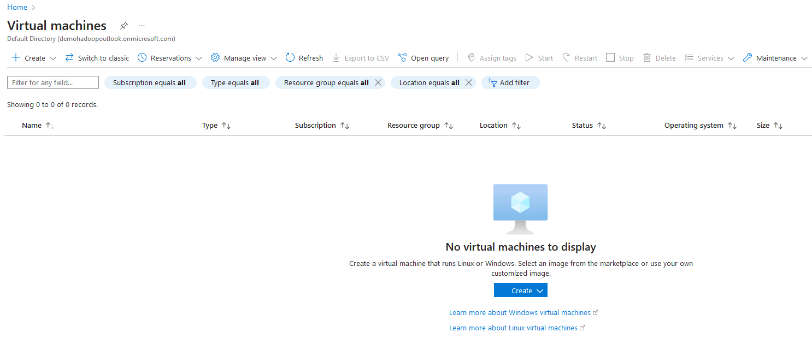
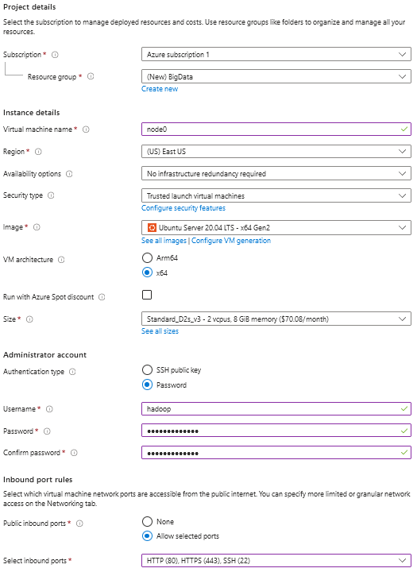
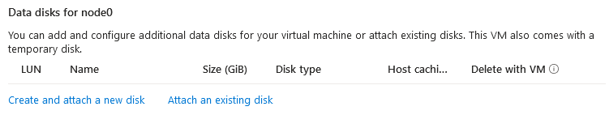
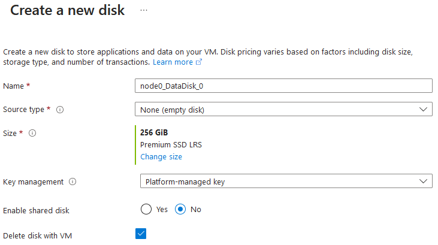
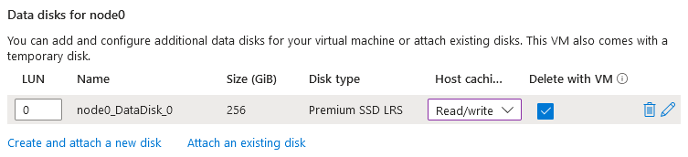
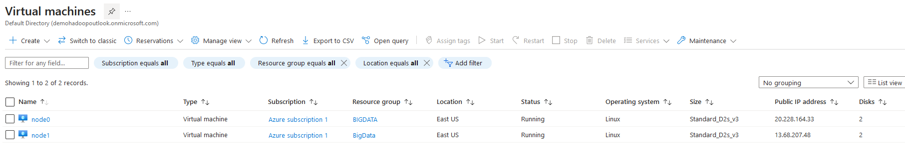
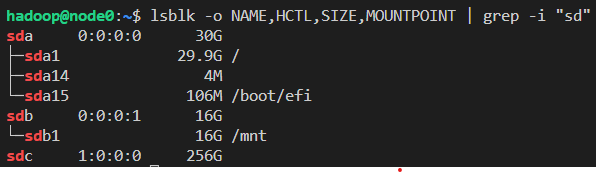
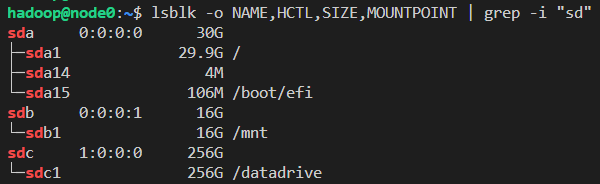
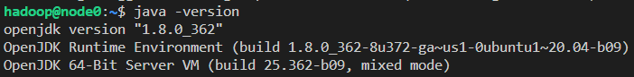

# Big Data - Análisis de sentimiento en tweets sobre el COVID-19

## Integrantes
* Luis Carbajal
* Jorge Castillo

## Pasos para reproducir

### Creación de máquinas virtuales
1. Crear una cuenta en Microsoft Azure, puedes hacerlo desde [este enlace](https://azure.microsoft.com/en-us/free).
2. En el portal de Azure, ir a la sección de máquinas virtuales y hacer click en "Create".

   

4. Modificar la configuración básica de la máquin virtual a crear. Los campos a modificar son el tamaño (Standard_D2s_v3), el tipo de autenticación (password) y el username/password (a preferencia, debe ser el mismo en ambas máquinas virtuales).

   

5. En la sección de "Disks" hacer click en "Create and attach new disk".

   

6. Crear el disco de 256 GB de tamaño. Luego asegurarse que esté en modo Read/write.
   
   
   

7. Crear la máquina virtual. Repetir el mismo proceso desde el paso 2 para la segunda máquina virtual. Al finalizar, la sección de máquinas virtuales debería contener ambas máquinas creadas.
   

### Montar discos agregados

1. Conectarse a una de las máquinas virtuales con ssh usando el usuario y la ip pública de la máquina. Cuando se solicite, ingresar la contraseña.
   ```
   ssh usuario@ip-publica
   ```
2. Encontrar el disco agregado usando el comando y viendo aquel con el tamaño esperado:
   ```
   lsblk -o NAME,HCTL,SIZE,MOUNTPOINT | grep -i "sd"
   ```
   El output obtenido es similar al siguiente, donde sdc es el disco objetivo:

   

3. Particiona el disco con los siguientes comandos adptándolos al nombre de tu disco:
   ```
   sudo parted /dev/sdc --script mklabel gpt mkpart xfspart xfs 0% 100%
   sudo mkfs.xfs /dev/sdc1
   sudo partprobe /dev/sdc1
   ```
4. Monta el disco usando los siguientes comandos:
   ```
   sudo mkdir /datadrive
   sudo mount /dev/sdc1 /datadrive
   ```
   Puedes correr una vez más el comando en el paso 2 para verificar que se haya montado correctamente. El output obtenido debría ser similar al siguiente:

   

5. Actualizar los permisos del directorio sobre el que se montó el disco:
   ```
   sudo chmod -R 777 /datadrive
   ```
   Repetir todo el procedimiento para la otra máquina virtual.
   
### Instalación de Hadoop
Todos los pasos en esta sección deben realizarse sobre la máquina que va a actura como nodo master, a menos que se indique lo contrario.

1. Actualizar el sistema de la máquina virtual e instalar Java con los comandos:
   ```
   sudo apt-get update && sudo apt-get upgrade
   sudo apt-get install openjdk-8-jdk
   ```
   Puedes verificar la instalación con el comando:
   ```
   java -version
   ```
   El output debería ser similar al siguiente:

   

2. Editar el archivo /etc/hosts agregando las ips privadas de ambas máquinas virtuales con sus respectivos roles. El archivo debería verse de la siguiente forma:
   ```
   10.0.0.4 node-master
   10.0.0.5 node1
   ```
   Repetir los pasos 1 y 2 en la otra máquina virtual

3. Generar una llave SSH para la conexión entre nodos con el siguiente comando y dejando todos los campos solicitados en blanco:
   ```
   ssh-keygen -b 4096
   ```
   Se generará una llave pública en el archivo /home/hadoop/.ssh/id_rsa.pub. Copiar el contenido del archivo y colocarlo en ~/.ssh/authorized_keys en ambas máquinas virtuales.

4. Descargar y descomprimir los binarios de Hadoop con los siguientes comandos:
   ```
   cd
   wget https://dlcdn.apache.org/hadoop/common/hadoop-3.2.4/hadoop-3.2.4.tar.gz
   tar -xzf hadoop-3.2.4.tar.gz
   mv hadoop-3.2.4 hadoop
   ```

5. Definir variables de entorno. Agregar en el archivo /home/hadoop/.profile la siguiente línea:
   ```
   PATH=/home/hadoop/hadoop/bin:/home/hadoop/hadoop/sbin:$PATH
   ```
   Agregar en el archivo /home/hadoop/.bashrc las siguientes líneas:
   ```
   export HADOOP_HOME=/home/hadoop/hadoop
   export PATH=${PATH}:${HADOOP_HOME}/bin:${HADOOP_HOME}/sbin
   ```

6. Configurar Hadoop. Agregar en el archivo ~/hadoop/etc/hadoop/hadoop-env.sh la siguiente línea:
   ```
   export JAVA_HOME=/usr/lib/jvm/java-8-openjdk-amd64/jre
   ```
   Actualizar el archivo ~/hadoop/etc/hadoop/core-site.xml a lo siguiente:
   ```
   <?xml version="1.0" encoding="UTF-8"?>
   <?xml-stylesheet type="text/xsl" href="configuration.xsl"?>
     <configuration>
       <property>
         <name>fs.default.name</name>
         <value>hdfs://node-master:9000</value>
       </property>
     </configuration>
   ```
   Actualizar el archivo ~/hadoop/etc/hadoop/hdfs-site.xml a lo siguiente:
   ```
   <configuration>
    <property>
            <name>dfs.namenode.name.dir</name>
            <value>/home/hadoop/data/nameNode</value>
    </property>

    <property>
            <name>dfs.datanode.data.dir</name>
            <value>/datadrive/data/dataNode</value>
    </property>

    <property>
            <name>dfs.replication</name>
            <value>1</value>
    </property>
   </configuration>
   ```
   Actualizar el archivo ~/hadoop/etc/hadoop/core-site.xml a lo siguiente:
   ```
   <?xml version="1.0" encoding="UTF-8"?>
   <?xml-stylesheet type="text/xsl" href="configuration.xsl"?>
     <configuration>
       <property>
         <name>fs.default.name</name>
         <value>hdfs://node-master:9000</value>
       </property>
     </configuration>
   ```
   Actualizar el archivo ~/hadoop/etc/hadoop/core-site.xml a lo siguiente:
   ```
   <?xml version="1.0" encoding="UTF-8"?>
   <?xml-stylesheet type="text/xsl" href="configuration.xsl"?>
     <configuration>
       <property>
         <name>fs.default.name</name>
         <value>hdfs://node-master:9000</value>
       </property>
     </configuration>
   ```

### Instalación de Spark


### Obtención y preprocesamiento de datos
Los pasos a seguir para obtener los datos junto con los scripts para realizar el preprocesamiento se encuentran detallados en el archivo preprocessing.ipynb.

### Entrenamiento y evaluación del modelo
Los pasos a seguir junto con los scripts para entrenar y evaluar el modelo de Machine Learning se encuentran detallados en el archivo machine_learning.ipynb.
